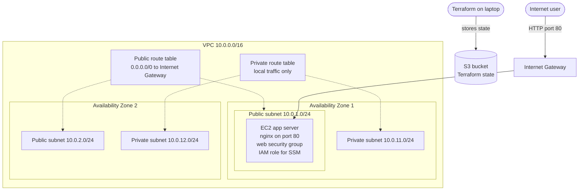

# Architecture

```mermaid
flowchart TB
    user([Internet user])
    igw[Internet Gateway]

    subgraph vpc["VPC 10.0.0.0/16"]
        subgraph az1["Availability Zone 1"]
            subgraph pub1["Public subnet 10.0.1.0/24"]
                ec2["EC2 app server<br/>nginx on port 80<br/>web security group<br/>IAM role for SSM"]
            end
            priv1["Private subnet 10.0.11.0/24"]
        end
        subgraph az2["Availability Zone 2"]
            pub2["Public subnet 10.0.2.0/24"]
            priv2["Private subnet 10.0.12.0/24"]
        end
        pubrt["Public route table<br/>0.0.0.0/0 to Internet Gateway"]
        privrt["Private route table<br/>local traffic only"]
    end

    laptop([Terraform on laptop])
    state[("S3 bucket<br/>Terraform state")]

    user -->|HTTP port 80| igw
    igw --> ec2
    pubrt -.-> pub1
    pubrt -.-> pub2
    privrt -.-> priv1
    privrt -.-> priv2
    laptop -->|stores state| state
```